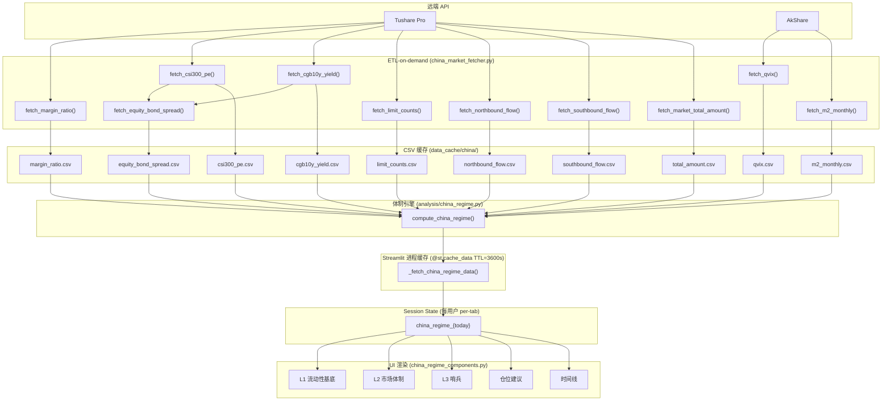
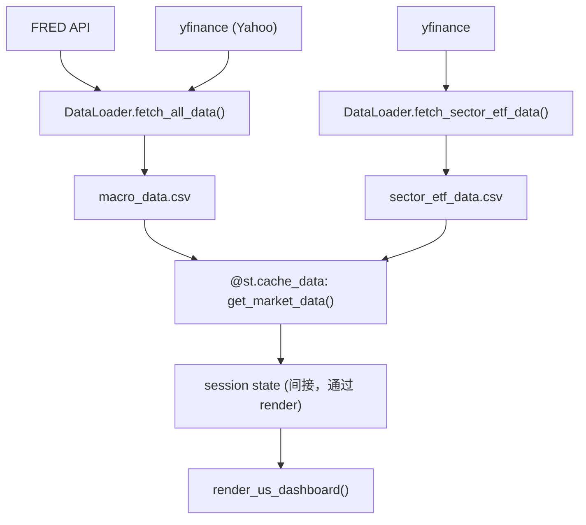

# Data Flow Specification — Macro Liquidity AI Analyst

*Generated: 2026-05-15 | 适用版本: multipage 重构后*

---

## 1. 数据源目录

| 数据源 | 类型 | 覆盖范围 | API 限制 |
|--------|------|----------|----------|
| **FRED** (Federal Reserve) | REST API | 美联储资产负债表 (WALCL)、RRP、TGA、SOFR | 免费，需 API Key，无 rate-limit 限制 |
| **Yahoo Finance** (yfinance) | 非官方爬虫 | SPY / SPX、VIX、DXY、行业 ETF (XLK 等) | 无 Key，偶发 429 |
| **Tushare Pro** | REST API | A 股两融 (margin)、PE-TTM、国债收益率、北/南向资金、涨停跌停、成交额、总市值 | 需积分订阅；T+1 发布延迟；margin API 返回三行 (BSE+SSE+SZSE) |
| **AkShare** | 爬虫 | QVIX (50ETF 期权波动率)、M2、沪深300/创业板指数日线 | 无 Key；QVIX 约 3-5 日延迟 |
| **OpenRouter / Gemini** | LLM API | AI 宏观报告生成 | 按 token 计费；结果缓存至 data_cache/reports/ |

---

## 2. 缓存文件清单

### 2.1 A 股细粒度缓存（ETL-on-demand，追加写入）

存储路径：`data_cache/china/`
格式：CSV，index 为日期 (YYYY-MM-DD)
更新策略：只有今日数据不存在时才调 API，历史行永不覆盖

| 文件 | 指标 | 数据源 | 更新频率 | 备注 |
|------|------|--------|----------|------|
| `margin_ratio.csv` | 两融余额市值比 (%) | Tushare `pro.margin` + `pro.daily_basic` | 交易日 T+1 | API 返回全市场三行，需汇总 rzrqye |
| `csi300_pe.csv` | 沪深300 PE-TTM | Tushare `index_dailybasic` | 交易日 T+1 | |
| `cgb10y_yield.csv` | 10年国债收益率 (%) | Tushare `cb_daily` | 交易日 T+1 | |
| `equity_bond_spread.csv` | 股债利差 = 1/PE - 10Y (%) | 由 csi300_pe + cgb10y_yield 计算 | 交易日 | 非直接 API，派生指标 |
| `limit_counts.csv` | 涨停/跌停家数 | Tushare `limit_list_d` | 交易日 T+1 | |
| `northbound_flow.csv` | 北向资金净流入 (亿元) | Tushare `moneyflow_hsgt` | 交易日 T+1 | 2024-08 后实时披露已停止 |
| `southbound_flow.csv` | 南向资金净流入 (亿元) | Tushare `moneyflow_hsgt` | 交易日 T+1 | |
| `qvix.csv` | 50ETF 期权隐波 (QVIX) | AkShare `index_option_50etf_qvix` | 交易日（约 3-5 日延迟） | stale=True 时使用 last-known-good |
| `m2_monthly.csv` | M2 货币供应量 (亿元) | AkShare `macro_china_m2_yearly` | 月频 | 数据单位直接为亿元 |
| `total_amount.csv` | A 股日成交额 (亿元) | Tushare `index_daily` amount | 交易日 T+1 | 千元→亿元 ÷ 1e5 |
| `total_mv_daily.csv` | A 股总市值 (亿元) | Tushare `daily_basic` total_mv | 交易日 | 万元→亿元 ÷ 1e4 |
| `deposit_ratio.csv` | 存款市值比 (%) | AkShare / Tushare | 月频 | |
| `index_hs300_daily.csv` | 沪深300 日线收盘价 | AkShare `stock_zh_index_daily` | 交易日 | 用于图表叠加 |
| `index_gem_daily.csv` | 创业板指日线收盘价 | AkShare `stock_zh_index_daily` | 交易日 | 用于图表叠加 |

### 2.2 美股/全球粗粒度缓存（整体刷新）

存储路径：`data_cache/`
格式：CSV，index 为日期
更新策略：检查文件 mtime（当天内不重拉）；整体删除后重拉

| 文件 | 覆盖指标 | 数据源 | 刷新条件 |
|------|----------|--------|----------|
| `macro_data.csv` | WALCL、RRP、TGA、SOFR、SPX、VIX、DXY | FRED + yfinance | 文件 mtime 非今日 |
| `sector_etf_data.csv` | XLK / XLV / XLF / XLE / XLI / XLY / XLP / XLB / XLRE / XLU / XLC | yfinance | 文件 mtime 非今日 |
| `china_data.csv` | 中国宏观综合（M1/M2、社融、北向等旧管道） | AkShare + Tushare | 文件 age > 24h |

### 2.3 其他持久化文件

| 文件 | 内容 | 更新方 |
|------|------|--------|
| `data_cache/sync_log.json` | 每次 API 调用的 last_sync_utc / duration_s / status / last_data_date | `_record_sync()` context manager 自动写入 |
| `data_cache/china_sentinel_state.json` | 哨兵状态 (CLEAR/TRIGGERED/COOLING)，跨重启持久化 | `compute_china_regime()` |
| `data_cache/china_regime_history.csv` | 体制评分历史快照 | `compute_china_regime()` |
| `data_cache/reports/YYYY-MM-DD_lang.json` | LLM 生成报告缓存 | `MacroAnalyst` / `RegimeNarrator` |

---

## 3. 数据流链路图

### 3.1 A 股体制评分链路（主路径）



### 3.2 美股宏观链路



### 3.3 Streamlit 多页面缓存层级

```
┌─────────────────────────────────────────────────────────┐
│ 磁盘 CSV (永久)                                          │
│  data_cache/china/*.csv  data_cache/*.csv               │
└────────────────────┬────────────────────────────────────┘
                     │ cache miss → API 调用
                     ▼
┌─────────────────────────────────────────────────────────┐
│ 进程级内存 @st.cache_data (TTL=3600s, 跨用户共享)        │
│  _fetch_china_regime_data()  get_market_data()          │
└────────────────────┬────────────────────────────────────┘
                     │ 首次渲染
                     ▼
┌─────────────────────────────────────────────────────────┐
│ Session State (per-user, per-browser-tab)               │
│  st.session_state["china_regime_{YYYY-MM-DD}"]         │
│  st.session_state["language"]                           │
└─────────────────────────────────────────────────────────┘
```

---

## 4. 已知性能瓶颈

| # | 问题 | 影响 | 所在位置 |
|---|------|------|----------|
| **B-1** | A 股历史补全（首次加载） | 首次启动 1-2 分钟 | `china_market_fetcher.py` 各 `fetch_*` 函数；需从 2015 年逐日回填 |
| **B-2** | 双重 fetch：`render_china_dashboard` 在 `_fetch_china_regime_data` 之后重新调用 `fetch_margin_ratio`、`fetch_equity_bond_spread`、`fetch_deposit_ratio` | 每次渲染 3 次重复 CSV 读取 | `src/ui/app.py` `render_china_dashboard()` |
| **B-3** | `@st.cache_data` 跨页面失效：Streamlit multipage 切页时进程级缓存保持，但 session_state 在 page reload 时不自动跨页持久化 | 语言切换后某些文本不刷新（需 st.rerun） | 各 page 文件侧边栏 language 切换逻辑 |
| **B-4** | `fetch_margin_ratio` 每次请求调两次 Tushare API（pro.margin + pro.daily_basic），串行 | 约 2-4 秒 | `china_market_fetcher.py:fetch_margin_ratio` |
| **B-5** | `DataLoader.fetch_all_data` 串行拼接 FRED + Yahoo | 约 5-10 秒 | `src/data/loader.py` |
| **B-6** | LLM 报告生成（首次，无缓存） | 约 10-20 秒 | `src/llm/` MacroAnalyst / RegimeNarrator |

---

## 5. 优化建议

### 5.1 短期（无需架构变更）

**[OPT-1] 消除双重 fetch（B-2）**
`render_china_dashboard` 从 `_fetch_china_regime_data` 返回值中直接读取已经抓取的数据，而非再次调用 `fetch_margin_ratio` 等。需要让 `_fetch_china_regime_data` 把原始值以 dataclass/dict 一并返回。
预期收益：减少 3 次 CSV 读取，页面渲染提速约 0.1-0.3s。

**[OPT-2] 并行化 A 股 fetcher（B-4, B-5）**
用 `concurrent.futures.ThreadPoolExecutor` 并发调用 10 个 fetcher（Tushare / AkShare 均非异步，用线程即可）。
预期收益：首次冷启动从 ~20s 降至 ~6-8s（IO bound）。

**[OPT-3] 预热 `@st.cache_data` 在后台**
在 main.py 启动时用 background thread 调用 `get_market_data()`，让进程级缓存在用户访问前先 warm up。

### 5.2 中期（中等改动）

**[OPT-4] 细化 `DataLoader` CSV 缓存为追加式（对齐 china fetcher）**
当前 `macro_data.csv` 逐日整体重拉（只检查 mtime）。改为像 `china_market_fetcher` 一样只补今日缺失行，避免全量重拉。
影响文件：`src/data/loader.py`

**[OPT-5] Async LLM 报告（B-6）**
AI 报告生成改为 `asyncio` + streaming（OpenAI `stream=True`），在 `st.write_stream()` 中实时渲染，消除 10-20s 阻塞白屏。

### 5.3 长期（架构级）

**[OPT-6] 后台定时刷新**
用 APScheduler 或系统 cron 在每天 09:30 收市后自动调用所有 fetcher，使用户打开应用时数据已经就绪（cache hit 路径）。

**[OPT-7] DuckDB 替代 CSV**
CSV 追加写入在高频读取时效率低（每次 `pd.read_csv` 全量解析）。迁移到 DuckDB，支持 SQL 查询、列式压缩、并发读写。预期内存/IO 收益显著，但需较大重构。

---

## 6. 同步遥测（sync_log.json）字段说明

`data_cache/sync_log.json` 由 `_record_sync()` context manager 自动写入，结构：

```json
{
  "china/margin_ratio.csv": {
    "last_sync_utc": "2026-05-15T02:31:04",
    "duration_s": 3.42,
    "status": "success",
    "last_data_date": "2026-05-14"
  },
  "macro_data.csv": {
    "last_sync_utc": "2026-05-15T01:05:11",
    "duration_s": 8.17,
    "status": "success",
    "last_data_date": "2026-05-14"
  }
}
```

| 字段 | 类型 | 说明 |
|------|------|------|
| `last_sync_utc` | ISO 8601 string | API 调用完成的 UTC 时间 |
| `duration_s` | float | 从进入 `_record_sync` 到退出（含 CSV 写入）的耗时（秒） |
| `status` | `"success"` \| `"error"` | 是否抛异常 |
| `last_data_date` | `"YYYY-MM-DD"` \| null | CSV 最后一行的日期索引值 |

Duration > 30s 在 Data Management 页面以 ⚡ 标记提示慢同步。

---

*本文档由代码自动分析生成，如有结构变化请同步更新。*
